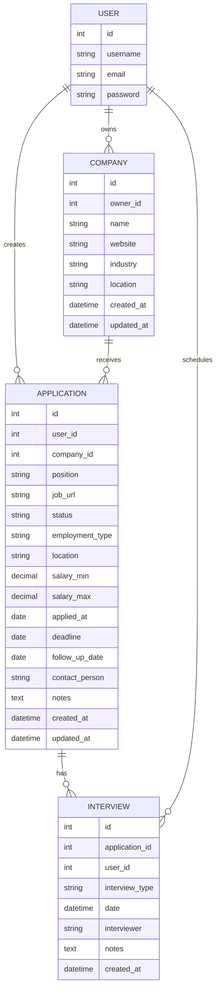
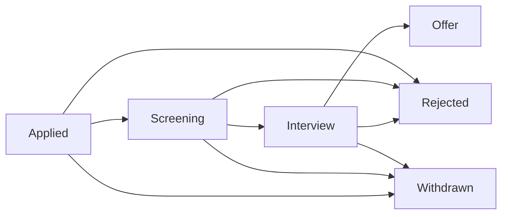
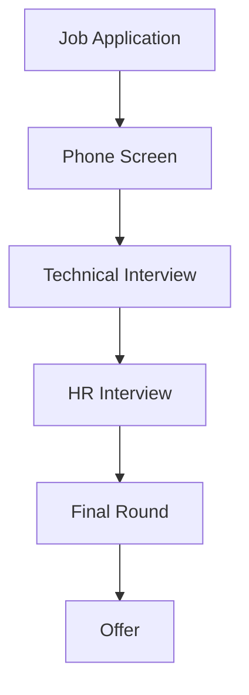
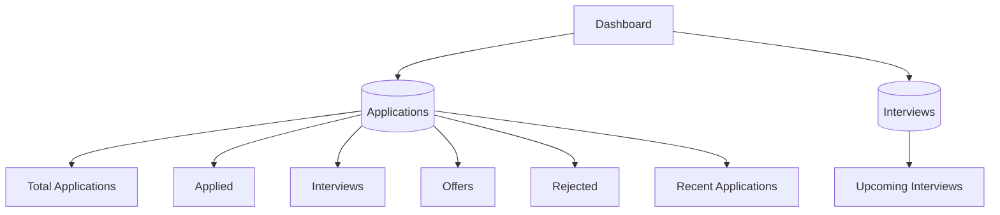
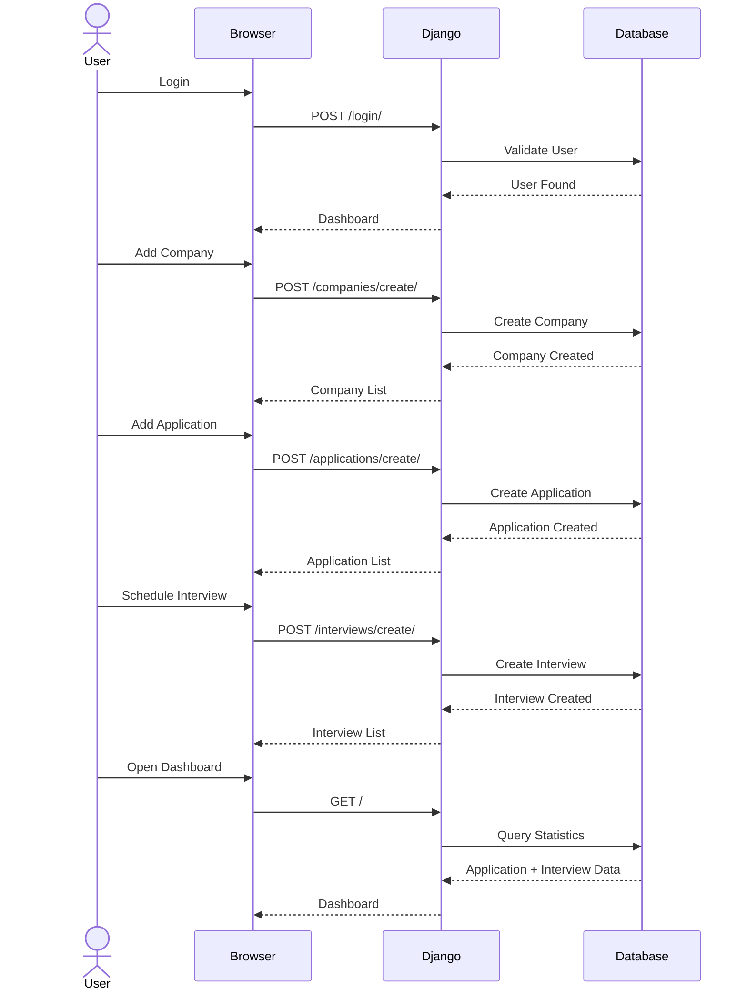

# JobTrack

> A full-stack Django web application for managing job applications, companies, interviews, and job-search analytics.

JobTrack helps job seekers organize their entire job-search process in one place.

Instead of maintaining applications in spreadsheets or scattered notes, JobTrack provides a centralized dashboard to track:

- Job applications
- Companies
- Application statuses
- Employment types
- Interviews
- Recruiters and contacts
- Deadlines
- Follow-up dates
- Application statistics

---

## Features

### Authentication

- User registration
- User login
- User logout
- User-specific data
- Secure ownership of applications and companies

### Dashboard

- Total applications
- Applied applications
- Interviews
- Offers
- Rejected applications
- Recent applications
- Upcoming interviews
- Job-search overview

### Application Management

- Create applications
- View applications
- Update applications
- Delete applications
- Search applications
- Filter by status
- Filter by employment type
- Pagination
- Application details

### Company Management

- Create companies
- Update companies
- Delete companies
- Search companies
- Pagination
- Application count per company
- Last application date
- Industry
- Location
- Website

### Interview Tracking

- Create interviews
- View interviews
- Update interviews
- Delete interviews
- Interview type
- Interview date and time
- Interviewer
- Interview notes
- Upcoming interviews

---

# Architecture

## High-Level Architecture

```mermaid
flowchart TD

    User["User"]

    Browser["Web Browser"]

    Django["Django Application"]

    Auth["Authentication"]

    Dashboard["Dashboard"]

    Applications["Applications"]

    Companies["Companies"]

    Interviews["Interviews"]

    Database[("SQLite / PostgreSQL")]

    User --> Browser

    Browser --> Django

    Django --> Auth
    Django --> Dashboard
    Django --> Applications
    Django --> Companies
    Django --> Interviews

    Auth --> Database
    Dashboard --> Database
    Applications --> Database
    Companies --> Database
    Interviews --> Database
````

---

# Application Architecture

```mermaid
flowchart LR

    Client["Browser"]

    URLs["Django URLs"]

    Views["Views"]

    Forms["Forms"]

    Models["Models"]

    DB[("Database")]

    Templates["Django Templates"]

    Client --> URLs

    URLs --> Views

    Views --> Forms

    Forms --> Models

    Views --> Models

    Models --> DB

    Views --> Templates

    Templates --> Client
```

JobTrack follows Django's traditional request-response architecture:

```text
Browser
   ↓
URL
   ↓
View
   ↓
Form / Model
   ↓
Database
   ↓
View
   ↓
Template
   ↓
Browser
```

---

# Database Architecture



---

# Data Relationships

```text
User
 │
 ├───────────────┐
 │               │
 ▼               ▼
Company       Application
 │               │
 │               │
 └───────┐       │
         ▼       ▼
       Application
            │
            ▼
        Interview
```

### Relationships

* One user can own many companies.
* One user can create many applications.
* One company can have many applications.
* One application can have multiple interviews.
* One user can have multiple interviews.

---

# Project Structure

```text
JobTrack/
│
├── manage.py
│
├── jobtrack/
│   │
│   ├── __init__.py
│   ├── settings.py
│   ├── urls.py
│   ├── asgi.py
│   └── wsgi.py
│
│
├── applications/
│   │
│   ├── migrations/
│   │
│   ├── templates/
│   │   └── applications/
│   │       ├── application_list.html
│   │       ├── application_form.html
│   │       ├── application_detail.html
│   │       ├── application_confirm_delete.html
│   │       ├── company_list.html
│   │       ├── company_form.html
│   │       └── company_confirm_delete.html
│   │
│   ├── admin.py
│   ├── apps.py
│   ├── forms.py
│   ├── models.py
│   ├── urls.py
│   ├── views.py
│   └── faker.py
│
│
├── interviews/
│   │
│   ├── migrations/
│   │
│   ├── templates/
│   │   └── interviews/
│   │       ├── interview_list.html
│   │       ├── interview_form.html
│   │       ├── interview_detail.html
│   │       └── interview_confirm_delete.html
│   │
│   ├── admin.py
│   ├── apps.py
│   ├── forms.py
│   ├── models.py
│   ├── urls.py
│   └── views.py
│
│
├── templates/
│   ├── base.html
│   ├── dashboard.html
│   ├── login.html
│   └── register.html
│
│
├── static/
│   └── css/
│       └── style.css
│
│
├── requirements.txt
│
└── README.md
```

---

# Application Status Flow

Job applications can move through different stages:



Available statuses:

| Status    | Description                            |
| --------- | -------------------------------------- |
| Applied   | Application has been submitted         |
| Screening | Application is under initial screening |
| Interview | Candidate has reached interview stage  |
| Offer     | Company has made an offer              |
| Rejected  | Application was rejected               |
| Withdrawn | Candidate withdrew the application     |

---

# Interview Flow



Interview types:

* Phone Screen
* Technical
* HR Interview
* Final Round

---

# Dashboard Data Flow



---

# Tech Stack

## Backend

* Python
* Django
* Django ORM
* Django Authentication

## Frontend

* HTML5
* CSS3
* Bootstrap 5
* Django Templates

## Database

Development:

* SQLite

Production:

* PostgreSQL

## Development Tools

* Git
* GitHub
* VS Code
* Faker

---

# Installation

## 1. Clone Repository

```bash
git clone https://github.com/maroofiums/Job-Application-Tracker.git
```

```bash
cd job-application-tracker
```

---

## 2. Create Virtual Environment

### Windows

```bash
python -m venv venv
```

Activate:

```bash
venv\Scripts\activate
```

### Linux / macOS

```bash
python3 -m venv venv
```

```bash
source venv/bin/activate
```

---

## 3. Install Dependencies

```bash
pip install -r requirements.txt
```

---

## 4. Run Migrations

```bash
python manage.py makemigrations
```

```bash
python manage.py migrate
```

---

## 5. Create Superuser

```bash
python manage.py createsuperuser
```

---

## 6. Run Development Server

```bash
python manage.py runserver
```

Open:

```text
http://127.0.0.1:8000/
```

---

# Fake Data

JobTrack includes a Faker utility for generating development data.

Open Django shell:

```bash
python manage.py shell
```

Then:

```python
from applications.faker import seed_database
```

Run:

```python
seed_database("your_username")
```

Example:

```python
seed_database("maroof")
```

This can generate:

* Companies
* Applications
* Interviews

Useful for testing the dashboard, pagination, filters, and analytics.

---

# Main Routes

| Route                        | Purpose            |
| ---------------------------- | ------------------ |
| `/`                          | Dashboard          |
| `/login/`                    | Login              |
| `/register/`                 | Register           |
| `/logout/`                   | Logout             |
| `/applications/`             | Application list   |
| `/applications/create/`      | Create application |
| `/applications/<id>/`        | Application detail |
| `/applications/<id>/update/` | Edit application   |
| `/applications/<id>/delete/` | Delete application |
| `/companies/`                | Company list       |
| `/companies/create/`         | Create company     |
| `/companies/<id>/update/`    | Edit company       |
| `/companies/<id>/delete/`    | Delete company     |
| `/interviews/`               | Interview list     |
| `/interviews/create/`        | Create interview   |
| `/interviews/<id>/`          | Interview detail   |
| `/interviews/<id>/update/`   | Edit interview     |
| `/interviews/<id>/delete/`   | Delete interview   |
| `/admin/`                    | Django Admin       |

---

# Security

JobTrack uses user ownership to isolate data.

For example:

```python
Application.objects.filter(
    user=request.user
)
```

and:

```python
Company.objects.filter(
    owner=request.user
)
```

This prevents one user from accessing another user's applications or companies.

Interview records also belong to a specific user:

```python
Interview.objects.filter(
    user=request.user
)
```

---

# Example Workflow



---

# Future Improvements

Planned features:

* [ ] Dashboard charts
* [ ] Monthly application analytics
* [ ] Application success rate
* [ ] Interview conversion rate
* [ ] Advanced search
* [ ] Date-range filtering
* [ ] Interview reminders
* [ ] Email notifications
* [ ] Resume management
* [ ] Job description storage
* [ ] REST API with Django REST Framework
* [ ] PostgreSQL production database
* [ ] Redis caching
* [ ] Celery background tasks
* [ ] Docker
* [ ] CI/CD
* [ ] Deployment

---

# Learning Goals

This project is designed to practice real-world Django development concepts:

* Django project architecture
* Django apps
* Models and relationships
* ForeignKey
* ModelForms
* CRUD
* Authentication
* Authorization
* QuerySets
* Filtering
* Searching
* Pagination
* Aggregation
* `select_related`
* Django templates
* Bootstrap
* Database design
* User-owned data
* Dashboard development
* Production-ready backend patterns

---

# License

This project is available for learning and personal development purposes.

---

# Author

**Maroof**

Built with:

```text
Python + Django + Bootstrap
```

```text
JobTrack — Organize your job search. Track your progress. Land your next opportunity.
```
